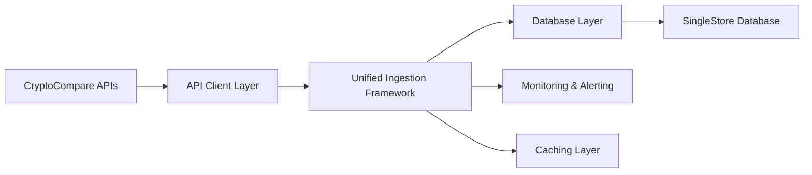

# Unified Data Ingestion Framework

A comprehensive, asynchronous data ingestion pipeline for CryptoCompare data with advanced monitoring, caching, and error handling capabilities.

## 🚀 Quick Start

### Basic Usage

```bash
# Install dependencies
pip install -r requirements.txt

# Set up environment variables
cp .env.example .env
# Edit .env with your configuration

# Ingest spot OHLCV data for top 50 pairs
python scripts/unified_ingest.py spot_ohlcv --pair_limit 50 --interval 1d

# Ingest futures data with monitoring enabled
python scripts/unified_ingest.py futures_ohlcv --enable_monitoring --interval 1h

# Ingest indices data for top assets
python scripts/unified_ingest.py indices_ohlcv --asset_limit 100 --market cadli

# Get system status
python scripts/unified_ingest.py status --enable_monitoring
```

### Batch Operations

```bash
# Create a batch configuration file
cat > batch_config.json << EOF
[
  {
    "data_type": "spot_ohlcv",
    "interval": "1d",
    "pair_limit": 100
  },
  {
    "data_type": "futures_ohlcv",
    "interval": "1d",
    "exchanges": ["binance", "okex"]
  },
  {
    "data_type": "asset_metadata"
  }
]
EOF

# Run batch ingestion
python scripts/unified_ingest.py batch --config batch_config.json --enable_monitoring
```

## 🏗️ Architecture Overview

The unified ingestion framework is built around these key principles:

- **Modularity**: Independent, interchangeable components
- **Asynchronous Operations**: Non-blocking I/O using `asyncio` and `aiohttp`
- **Centralized Configuration**: Single source for all application settings
- **Database-level Deduplication**: Efficient data integrity using database constraints
- **Robust Error Handling**: Comprehensive retry mechanisms and custom exceptions

### Core Components

```
src/
├── ingestion/
│   ├── config.py              # Centralized configuration management
│   ├── base.py                # Abstract base ingestor class
│   ├── cache.py               # Caching system with multiple backends
│   ├── monitoring.py          # Performance monitoring and alerting
│   └── ingestors/
│       ├── spot_ohlcv_ingestor.py
│       ├── futures_data_ingestor.py
│       ├── indices_ohlcv_ingestor.py
│       ├── asset_metadata_ingestor.py
│       ├── exchange_metadata_ingestor.py
│       └── instrument_metadata_ingestor.py
├── data_api/                  # API clients for different data sources
├── db/                        # Database abstraction layer
└── scripts/
    └── unified_ingest.py      # Main CLI entry point
```

### Data Flow



## 📦 Installation and Setup

### Prerequisites

- Python 3.9+
- SingleStore database
- CryptoCompare API key

### Environment Setup

1. **Clone and install dependencies:**
   ```bash
   git clone <repository-url>
   cd ccdata_handler
   pip install -e .
   ```

2. **Configure environment variables:**
   ```bash
   # Database configuration
   S2_HOST=your-singlestore-host
   S2_PORT=3306
   S2_USER=your-username
   S2_PASSWORD=your-password
   S2_DATABASE=your-database

   # API configuration
   CCDATA_API_KEY=your-cryptocompare-api-key
   DATA_API_BASE_URL=https://data-api.cryptocompare.com
   MIN_API_BASE_URL=https://min-api.cryptocompare.com/data

   # Ingestion settings
   INGESTION_BATCH_SIZE=1000
   INGESTION_PARALLEL_WORKERS=4
   INGESTION_BACKFILL_ENABLED=true
   INGESTION_MAX_BACKFILL_DAYS=365

   # Rate limiting
   API_RATE_LIMIT_PER_SECOND=10.0
   API_RATE_LIMIT_PER_MINUTE=300
   API_RATE_LIMIT_PER_HOUR=10000

   # Logging
   LOG_LEVEL=INFO
   LOG_FILE_ENABLED=true
   LOG_FILE_PATH=logs/ingestion.log

   # Monitoring
   MONITORING_METRICS_ENABLED=true
   MONITORING_PERFORMANCE_ENABLED=true
   MONITORING_ALERT_ON_FAILURE=true
   ```

3. **Initialize database schema:**
   ```bash
   # Run the schema creation script
   mysql -h $S2_HOST -u $S2_USER -p$S2_PASSWORD $S2_DATABASE < sql/create_schema.sql
   ```

## 🔧 Configuration

### Environment-Specific Configuration

The framework supports multiple environments (development, staging, production):

```bash
# Use environment-specific config files
.env                    # Base configuration
.env.development       # Development overrides
.env.staging          # Staging overrides
.env.production       # Production overrides

# Set environment
export ENVIRONMENT=production
```

### Advanced Configuration Options

```python
# src/ingestion/config.py provides these configuration sections:

# Database Configuration
DB_POOL_SIZE=10                    # Connection pool size
DB_MAX_OVERFLOW=20                 # Max overflow connections
DB_POOL_TIMEOUT=30                 # Pool timeout in seconds
DB_POOL_RECYCLE=3600              # Connection recycle time

# Ingestion Configuration
INGESTION_MAX_API_LIMIT=5000       # Max records per API call
INGESTION_API_CALL_DELAY=0.1       # Delay between API calls
INGESTION_CHUNK_SIZE=10000         # Database batch size
INGESTION_MAX_CONSECUTIVE_FAILURES=5
INGESTION_FAILURE_BACKOFF_MULTIPLIER=2.0
INGESTION_MAX_FAILURE_BACKOFF=300

# Futures-specific settings
FUTURES_EXCHANGES=binance,okex,bybit
FUTURES_INSTRUMENT_STATUSES=ACTIVE,EXPIRED
```

## 📊 Usage Patterns

### 1. Spot Market Data Ingestion

```bash
# Basic spot OHLCV ingestion
python scripts/unified_ingest.py spot_ohlcv \
  --interval 1d \
  --pair_limit 100

# Specific market or instrument
python scripts/unified_ingest.py spot_ohlcv \
  --interval 1h \
  --specific_market CCCAGG \
  --specific_instrument BTC-USD

# With advanced features
python scripts/unified_ingest.py spot_ohlcv \
  --interval 1d \
  --pair_limit 200 \
  --enable_monitoring \
  --enable_caching \
  --parallel_workers 8
```

### 2. Futures Data Ingestion

```bash
# Futures OHLCV data
python scripts/unified_ingest.py futures_ohlcv \
  --interval 1d \
  --exchanges binance okex

# Futures funding rates
python scripts/unified_ingest.py futures_funding_rate \
  --interval 1h \
  --instruments BTC-USDT-PERP ETH-USDT-PERP

# Futures open interest
python scripts/unified_ingest.py futures_open_interest \
  --interval 1d \
  --exchanges binance
```

### 3. Indices and Reference Rates

```bash
# Indices OHLCV data
python scripts/unified_ingest.py indices_ohlcv \
  --interval 1d \
  --asset_limit 50 \
  --market cadli

# With specific configuration
python scripts/unified_ingest.py indices_ohlcv \
  --interval 1h \
  --asset_limit 100 \
  --market cadli \
  --enable_monitoring
```

### 4. Metadata Ingestion

```bash
# Asset metadata
python scripts/unified_ingest.py asset_metadata

# Exchange metadata
python scripts/unified_ingest.py exchange_metadata

# Instrument metadata
python scripts/unified_ingest.py spot_instruments
python scripts/unified_ingest.py futures_instruments
```

### 5. Programmatic Usage

```python
import asyncio
from scripts.unified_ingest import UnifiedIngestCLI

async def custom_ingestion():
    # Initialize the CLI
    cli = UnifiedIngestCLI()
    await cli.initialize(
        enable_monitoring=True,
        enable_caching=True,
        parallel_workers=6
    )
    
    try:
        # Single ingestion
        result = await cli.ingest_single(
            data_type="spot_ohlcv",
            interval="1d",
            pair_limit=100
        )
        print(f"Ingestion result: {result}")
        
        # Batch ingestion
        batch_config = [
            {"data_type": "spot_ohlcv", "interval": "1d", "pair_limit": 50},
            {"data_type": "futures_ohlcv", "interval": "1d", "exchanges": ["binance"]},
            {"data_type": "asset_metadata"}
        ]
        
        batch_result = await cli.ingest_batch(batch_config)
        print(f"Batch result: {batch_result}")
        
        # Get system status
        status = await cli.get_status()
        print(f"System status: {status}")
        
    finally:
        await cli.cleanup()

# Run the custom ingestion
asyncio.run(custom_ingestion())
```

## 🔍 Monitoring and Observability

### Performance Monitoring

The framework includes comprehensive monitoring capabilities:

```bash
# Enable monitoring for any ingestion
python scripts/unified_ingest.py spot_ohlcv \
  --enable_monitoring \
  --pair_limit 100

# Check system status with monitoring details
python scripts/unified_ingest.py status --enable_monitoring
```

### Monitoring Features

- **Performance Tracking**: Automatic tracking of ingestion duration, throughput, and success rates
- **Health Checks**: Regular system health monitoring with configurable intervals
- **Alerting**: Automatic alerts on failures, consecutive failures, and performance degradation
- **Metrics Collection**: Detailed metrics on API calls, database operations, and system resources

### Log Analysis

```bash
# View ingestion logs
tail -f logs/ingestion.log

# Filter for specific data types
grep "spot_ohlcv" logs/ingestion.log

# Monitor error patterns
grep "ERROR" logs/ingestion.log | tail -20
```

## ⚡ Performance Optimization

### Caching

Enable caching to improve performance for repeated operations:

```bash
# Enable memory-based caching
python scripts/unified_ingest.py spot_ohlcv \
  --enable_caching \
  --pair_limit 100
```

### Parallel Processing

Optimize throughput with parallel workers:

```bash
# Increase parallel workers for large datasets
python scripts/unified_ingest.py futures_ohlcv \
  --parallel_workers 8 \
  --exchanges binance okex bybit
```

### Batch Size Tuning

Configure batch sizes based on your system:

```bash
# Environment variables for batch optimization
INGESTION_BATCH_SIZE=2000          # Larger batches for better throughput
INGESTION_CHUNK_SIZE=15000         # Database batch size
INGESTION_PARALLEL_WORKERS=6       # Parallel processing
```

## 🛠️ Troubleshooting

### Common Issues

1. **Rate Limit Exceeded**
   ```bash
   # Reduce rate limits in configuration
   API_RATE_LIMIT_PER_SECOND=5.0
   API_RATE_LIMIT_PER_MINUTE=150
   
   # Add delays between API calls
   INGESTION_API_CALL_DELAY=0.2
   ```

2. **Database Connection Issues**
   ```bash
   # Check database connectivity
   python -c "from src.db.connection import DbConnectionManager; db = DbConnectionManager(); print('Connection successful')"
   
   # Adjust connection pool settings
   DB_POOL_SIZE=5
   DB_MAX_OVERFLOW=10
   DB_POOL_TIMEOUT=60
   ```

3. **Memory Issues with Large Datasets**
   ```bash
   # Reduce batch sizes
   INGESTION_BATCH_SIZE=500
   INGESTION_CHUNK_SIZE=5000
   
   # Reduce parallel workers
   INGESTION_PARALLEL_WORKERS=2
   ```

4. **API Authentication Errors**
   ```bash
   # Verify API key configuration
   echo $CCDATA_API_KEY
   
   # Test API connectivity
   curl -H "Authorization: Apikey $CCDATA_API_KEY" \
        "https://data-api.cryptocompare.com/spot/v1/markets"
   ```

### Debug Mode

Enable detailed logging for troubleshooting:

```bash
# Set debug logging level
export LOG_LEVEL=DEBUG

# Run with verbose output
python scripts/unified_ingest.py spot_ohlcv \
  --pair_limit 10 \
  --enable_monitoring
```

### Performance Diagnostics

```bash
# Check system status
python scripts/unified_ingest.py status \
  --enable_monitoring \
  --enable_caching

# Monitor resource usage during ingestion
htop  # or top
iostat -x 1  # Monitor I/O
```

## 🔄 Scheduling and Automation

### Cron Job Examples

```bash
# Daily spot OHLCV ingestion at 2 AM
0 2 * * * cd /path/to/ccdata_handler && python scripts/unified_ingest.py spot_ohlcv --interval 1d --pair_limit 100

# Hourly futures data ingestion
0 * * * * cd /path/to/ccdata_handler && python scripts/unified_ingest.py futures_ohlcv --interval 1h --exchanges binance

# Weekly metadata refresh on Sundays at 3 AM
0 3 * * 0 cd /path/to/ccdata_handler && python scripts/unified_ingest.py batch --config weekly_metadata_batch.json
```

### Systemd Service Example

```ini
# /etc/systemd/system/ccdata-ingestion.service
[Unit]
Description=CryptoCompare Data Ingestion Service
After=network.target

[Service]
Type=oneshot
User=ccdata
WorkingDirectory=/opt/ccdata_handler
Environment=ENVIRONMENT=production
ExecStart=/opt/ccdata_handler/venv/bin/python scripts/unified_ingest.py spot_ohlcv --interval 1d --pair_limit 100 --enable_monitoring
StandardOutput=journal
StandardError=journal

[Install]
WantedBy=multi-user.target
```

## 🧪 Testing

### Unit Tests

```bash
# Run all tests
python -m pytest tests/

# Run specific test modules
python -m pytest tests/ingestion/test_config.py
python -m pytest tests/ingestion/test_cache.py

# Run with coverage
python -m pytest tests/ --cov=src --cov-report=html
```

### Integration Testing

```bash
# Test with small dataset
python scripts/unified_ingest.py spot_ohlcv \
  --pair_limit 5 \
  --interval 1d \
  --dry_run

# Validate data integrity
python -c "
from src.db.connection import DbConnectionManager
db = DbConnectionManager()
result = db.execute_query('SELECT COUNT(*) FROM ohlcv_spot_1d_raw LIMIT 10')
print(f'Records in database: {result}')
"
```

## 📈 Best Practices

### 1. Configuration Management
- Use environment-specific configuration files
- Never commit sensitive credentials to version control
- Validate configuration on startup

### 2. Error Handling
- Always use the built-in retry mechanisms
- Monitor and alert on consecutive failures
- Implement proper logging for debugging

### 3. Performance
- Enable caching for repeated operations
- Use appropriate batch sizes for your system
- Monitor resource usage and adjust parallel workers

### 4. Data Quality
- Leverage database constraints for deduplication
- Implement data validation in transform methods
- Monitor data freshness and completeness

### 5. Monitoring
- Enable monitoring for production workloads
- Set up alerts for critical failures
- Regularly review performance metrics

## 🔗 API Reference

### Supported Data Types

| Data Type | Description | Intervals | Key Parameters |
|-----------|-------------|-----------|----------------|
| `spot_ohlcv` | Spot market OHLCV data | 1d, 1h, 1m | `pair_limit`, `specific_market`, `specific_instrument` |
| `futures_ohlcv` | Futures OHLCV data | 1d, 1h, 1m | `exchanges`, `instruments` |
| `futures_funding_rate` | Futures funding rates | 1d, 1h, 1m | `exchanges`, `instruments` |
| `futures_open_interest` | Futures open interest | 1d, 1h, 1m | `exchanges`, `instruments` |
| `indices_ohlcv` | Indices OHLCV data | 1d, 1h, 1m | `asset_limit`, `market` |
| `asset_metadata` | Asset/cryptocurrency metadata | N/A | None |
| `exchange_metadata` | Exchange information | N/A | None |
| `spot_instruments` | Spot trading pairs | N/A | None |
| `futures_instruments` | Futures instruments | N/A | None |

### CLI Options

| Option | Description | Default |
|--------|-------------|---------|
| `--enable_monitoring` | Enable advanced monitoring | False |
| `--enable_caching` | Enable caching | False |
| `--parallel_workers` | Number of parallel workers | 4 |
| `--dry_run` | Perform dry run without ingesting | False |

## 📚 Additional Resources

- [Technical Guidelines](docs/data_ingestion_technical_guidelines.md) - Detailed technical documentation
- [Database Schema](database_schema.md) - Database structure and relationships
- [API Specifications](references/data_api/) - CryptoCompare API documentation
- [Migration Guide](docs/data_ingestion_technical_guidelines.md#migration-guidelines) - Migrating from legacy scripts

## 🤝 Contributing

1. Follow the coding standards outlined in the technical guidelines
2. Write comprehensive tests for new features
3. Update documentation for any API changes
4. Use the unified ingestion framework patterns for consistency

## 📄 License

This project is licensed under the MIT License - see the LICENSE file for details.