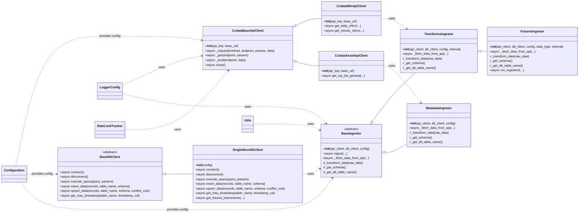
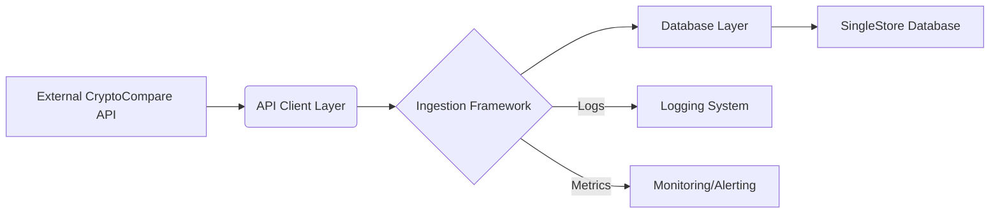

# Data Ingestion Technical Guidelines

## 1. Executive Summary

This document serves as a comprehensive technical guideline and implementation reference for the unified data ingestion pipeline. It outlines the architectural design, coding standards, asynchronous implementation patterns, performance optimization strategies, and migration guidelines. The primary goal is to ensure a modular, efficient, and maintainable pipeline with clear separation of concerns, robust error handling, and scalable asynchronous processing capabilities, addressing the findings from the analysis of existing systems.

## 2. Current State Analysis

Based on the analysis of existing data ingestion systems, several key findings were identified:

*   **Common Patterns**: Consistent patterns were observed in API client usage, data processing workflows, and database operations across various ingestion scripts.
*   **Significant Code Redundancies**: A substantial amount of repetitive code was found for setup, configuration, and basic operations, leading to increased maintenance overhead.
*   **Naming Convention Inconsistencies**: Inconsistencies in naming conventions for scripts, modules, classes, functions, and variables were noted, impacting code readability and maintainability.
*   **Different Implementation Approaches**: Distinct methods were used for time series data ingestion versus one-time metadata API calls, lacking a unified approach.
*   **Problematic Deduplication Function**: The existing `deduplicate_table` function, which uses `CREATE TABLE AS SELECT`, `DROP TABLE`, and `ALTER TABLE RENAME`, was identified as problematic due to potential data access issues and inefficiency.

## 3. Unified Architecture Design

The proposed unified architecture aims to address the identified issues by introducing a modular, asynchronous, and robust framework.

### 3.1. Architecture Overview and Principles

The architecture is designed around clear separation of concerns, reusability, and asynchronous processing. Key principles include:

*   **Modularity**: Components are designed to be independent and interchangeable.
*   **Asynchronous Operations**: All I/O-bound operations leverage `asyncio` for non-blocking execution.
*   **Centralized Configuration**: A single source for all application settings.
*   **Database-level Deduplication**: Leveraging database features for efficient data integrity.
*   **Robust Error Handling**: Comprehensive retry mechanisms and custom exceptions.

### 3.2. Component Descriptions

The architecture is composed of the following key components:

*   **Centralized Configuration Management (`src/config.py`)**: Provides a single source for all application configuration settings (API keys, URLs, DB credentials, logging levels). It loads environment variables and defines a type-hinted `AppConfig` class.
*   **Enhanced Base API Client (`src/base_api_client.py`)**: A robust, asynchronous base for all API interactions. It uses `aiohttp` for HTTP requests, `tenacity` for asynchronous retry logic, manages `aiohttp.ClientSession` for connection pooling, and integrates with a rate limit tracker.
*   **Abstract Database Operations (`src/db/base_db_client.py`, `src/db/singlestore_db_client.py`)**: Defines a consistent, asynchronous interface for database interactions. `BaseDbClient` is abstract, while `SingleStoreDbClient` provides concrete implementations using an async driver for SingleStore, focusing on efficient upsert strategies.
*   **Refined Logging and Error Handling (`src/logger_config.py`, `src/exceptions.py`)**: Provides centralized logging setup and defines custom exception types for specific error contexts (e.g., `ApiRateLimitExceededError`, `DataValidationError`).
*   **Abstract Ingestion Base Class (`src/ingestion/base_ingestor.py`)**: Defines the common interface and core orchestration logic for all data ingestors. It includes abstract methods for fetching, transforming, schema retrieval, and table naming, and a concrete `ingest` method for shared logic (pagination, batching, upsertion).
*   **Specialized Ingestors (`src/ingestion/time_series_ingestor.py`, `src/ingestion/metadata_ingestor.py`, `src/ingestion/futures_ingestor.py`)**: Concrete implementations of `BaseIngestor` for different data types. `TimeSeriesIngestor` handles time-series specific logic, `MetadataIngestor` handles one-time metadata, and `FuturesIngestor` (refactored) inherits from `TimeSeriesIngestor` for specific futures data types.
*   **Shared Utility Modules (`src/logger_config.py`, `src/rate_limit_tracker.py`, `src/utils.py`)**: Provide common, reusable functionalities like centralized logging, API rate limit tracking, and general helper functions.

### 3.3. Class Hierarchies and Interfaces

The following Mermaid diagram illustrates the key class hierarchies and their relationships:



### 3.4. Data Flow Patterns

#### High-Level Data Flow:



#### Detailed Ingestion Data Flow (within `BaseIngestor.ingest`):

```mermaid
sequenceDiagram
    participant O as Orchestration
    participant BI as BaseIngestor
    participant AC as API Client
    participant DB as Database Client
    participant UT as Utilities

    O->>BI: ingest(parameters)
    BI->>DB: Get last ingested timestamp (async)
    loop Data Fetching Loop
        BI->>BI: Determine batch `to_ts` and `limit`
        BI->>AC: _fetch_data_from_api(params) (async)
        AC->>UT: Check/Update Rate Limit
        AC->>AC: Make HTTP Request (aiohttp)
        AC-->>BI: Raw API Data (List[Dict])
        alt Data Received
            BI->>BI: Filter new records (based on timestamp)
            BI->>BI: Transform raw data (_transform_data)
            BI->>DB: Upsert transformed data (async, batched)
            DB-->>BI: Upsert Result
            BI->>UT: Log success
        else No Data
            BI->>UT: Log warning
        end
        BI->>BI: Advance `start_timestamp` for next batch
        alt End Condition Met
            BI->>O: Ingestion Complete
            break Loop
        end
    end
    O->>UT: Log overall ingestion status
```

## 4. Asynchronous Implementation Guidelines

Asynchronous programming is central to the new ingestion pipeline, enabling efficient handling of I/O-bound operations like API calls and database interactions.

### 4.1. Modern Python Async Patterns (`asyncio`, `aiohttp`)

*   **`asyncio`**: The core library for writing concurrent code using the `async`/`await` syntax. All I/O operations should be `await`able.
    *   Use `asyncio.run()` to execute the main asynchronous function.
    *   Use `asyncio.gather()` to run multiple coroutines concurrently, especially for parallel API calls or database upserts for different instruments/data streams.
*   **`aiohttp`**: The preferred library for making asynchronous HTTP requests.
    *   Always use `aiohttp.ClientSession` for making requests. A single session should be reused across multiple requests to leverage connection pooling.
    *   Ensure proper session closure using `await session.close()`.
*   **Async Context Managers (`async with`)**: Use `async with` for resources that need proper asynchronous setup and teardown, such as `aiohttp.ClientSession` or database connections/cursors. This ensures resources are acquired and released correctly, even if errors occur.

    ```python
    # Example: Using aiohttp.ClientSession with async context manager
    import aiohttp
    import asyncio

    async def fetch_url(url: str):
        async with aiohttp.ClientSession() as session:
            async with session.get(url) as response:
                response.raise_for_status() # Raise an exception for bad status codes
                return await response.text()

    # Example: Custom async context manager for a database connection
    # (This pattern is often abstracted within a DB client's connection pool)
    class AsyncDatabaseConnection:
        def __init__(self, db_config):
            self.db_config = db_config
            self.connection = None

        async def __aenter__(self):
            # Establish connection
            from singlestoredb.connection import connect as singlestore_connect
            self.connection = await singlestore_connect(
                host=self.db_config.DB_HOST,
                port=self.db_config.DB_PORT,
                user=self.db_config.DB_USER,
                password=self.db_config.DB_PASSWORD,
                database=self.db_config.DB_NAME,
                driver="asyncio",
            )
            return self.connection

        async def __aexit__(self, exc_type, exc_val, exc_tb):
            # Close connection
            if self.connection:
                await self.connection.close()
*   **Parallel API Calls for Multiple Assets/Exchanges**: When fetching data for multiple independent entities (e.g., different cryptocurrencies, different exchanges), `asyncio.gather` can significantly speed up the process.

    ```python
    # Example: Parallel fetching of data for multiple assets
    import asyncio
    from typing import List, Dict, Any
    from src.data_api.spot_api_client import CcdataSpotApiClient
    from src.config import config

    async def fetch_multiple_asset_data(assets: List[str], api_client: CcdataSpotApiClient) -> List[Dict]:
        """
        Fetches data for a list of assets in parallel.
        """
        tasks = []
        for asset in assets:
            # Assuming get_asset_details is an async method in CcdataSpotApiClient
            tasks.append(api_client.get_asset_details(asset_symbol=asset))
        
        # Run all tasks concurrently. return_exceptions=True ensures all tasks are awaited
        # even if some fail, returning the exception instead of raising it immediately.
        results = await asyncio.gather(*tasks, return_exceptions=True)
        
        successful_results = []
        for i, result in enumerate(results):
            if isinstance(result, Exception):
                print(f"Error fetching data for {assets[i]}: {result}")
            else:
                successful_results.append(result)
        return successful_results

    # Example usage:
    # async def main():
    #     api_client = CcdataSpotApiClient(api_key=config.CCDATA_API_KEY, base_url=config.DATA_API_BASE_URL)
    #     assets_to_fetch = ["BTC", "ETH", "XRP", "LTC"]
    #     data = await fetch_multiple_asset_data(assets_to_fetch, api_client)
    #     print(f"Fetched data for {len(data)} assets.")
    #     await api_client.close() # Ensure session is closed

    # if __name__ == "__main__":
    #     asyncio.run(main())
    ```

*   **Async Database Operations with Connection Pooling**: The `SingleStoreDbClient` should manage an asynchronous connection pool to efficiently handle concurrent database operations. This avoids the overhead of establishing a new connection for each query.

    ```python
    # Example: src/db/singlestore_db_client.py (simplified with connection pooling)
    import asyncio
    from typing import List, Dict, Any, Optional
    from singlestoredb.connection import ConnectionPool, connect as singlestore_connect
    from ..config import AppConfig
    from ..logger_config import get_logger
    from .base_db_client import BaseDbClient

    class SingleStoreDbClient(BaseDbClient):
        def __init__(self, config: AppConfig):
            self.config = config
            self.logger = get_logger(__name__)
            self._pool: Optional[ConnectionPool] = None

        async def connect(self):
            if self._pool is None:
                self.logger.info("Initializing SingleStoreDB connection pool...")
                self._pool = ConnectionPool(
                    host=self.config.DB_HOST,
                    port=self.config.DB_PORT,
                    user=self.config.DB_USER,
                    password=self.config.DB_PASSWORD,
                    database=self.config.DB_NAME,
                    driver="asyncio",
                    # Connection pool specific settings
                    min_size=5,  # Minimum number of connections in the pool
                    max_size=20, # Maximum number of connections in the pool
                    timeout=30,  # Timeout for acquiring a connection from the pool
                )
                self.logger.info("SingleStoreDB connection pool initialized.")

        async def disconnect(self):
            if self._pool:
                self.logger.info("Closing SingleStoreDB connection pool...")
                await self._pool.close()
                self._pool = None
                self.logger.info("SingleStoreDB connection pool closed.")

        async def execute_query(self, query: str, params: Optional[tuple] = None) -> Any:
            if not self._pool:
                await self.connect() # Ensure pool is initialized
            
            async with self._pool.acquire() as conn: # Acquire connection from pool
                async with conn.cursor() as cursor: # Use async context manager for cursor
                    await cursor.execute(query, params)
                    return await cursor.fetchall() # Or fetchone, etc.

        async def upsert_data(self, records: List[Dict[str, Any]], table_name: str, schema: Dict, conflict_cols: List[str]):
            if not records:
                self.logger.info(f"No records to upsert for table {table_name}.")
                return

            if not self._pool:
                await self.connect()

            # Construct INSERT ... ON DUPLICATE KEY UPDATE query
            columns = list(schema.keys())
            placeholders = ", ".join(["%s"] * len(columns))
            insert_cols = ", ".join([f"`{col}`" for col in columns])
            
            update_parts = []
            for col in columns:
                if col not in conflict_cols:
                    update_parts.append(f"`{col}` = VALUES(`{col}`)")
            update_clause = ", ".join(update_parts)

            query = f"INSERT INTO `{table_name}` ({insert_cols}) VALUES ({placeholders})"
            if update_clause:
                query += f" ON DUPLICATE KEY UPDATE {update_clause}"
            else:
                # If no update columns, just insert (or ignore if primary key exists)
                query += " ON DUPLICATE KEY UPDATE `id` = `id`" # Dummy update to avoid error

            values = [[record[col] for col in columns] for record in records]

            async with self._pool.acquire() as conn:
                async with conn.cursor() as cursor:
                    await cursor.executemany(query, values)
                    await conn.commit() # Commit the transaction
                    self.logger.info(f"Successfully upserted {len(records)} records into {table_name}.")

    # Example of parallel database upserts (e.g., in an ingestor)
    # async def ingest_multiple_tables_concurrently(db_client: SingleStoreDbClient, data_batches: List[Tuple[List[Dict], str, Dict, List[str]]]):
    #     tasks = []
    #     for records, table_name, schema, conflict_cols in data_batches:
    #         tasks.append(db_client.upsert_data(records, table_name, schema, conflict_cols))
    #     
    #     await asyncio.gather(*tasks, return_exceptions=True)
    #     print("Completed parallel database upserts.")
    ```

    # Usage example (if not using a pool managed by a client):
    # async def main():
*   **Specific Metrics and KPIs to Monitor**:
## 7. Common Pitfalls and Solutions

This section addresses common challenges encountered during data ingestion and provides recommended solutions.

### 7.1. Deduplication and Database Constraints

*   **The `deduplicate_table` Function Issue**: The existing `deduplicate_table` function, which uses `CREATE TABLE AS SELECT`, `DROP TABLE`, and `ALTER TABLE RENAME`, is problematic for several reasons:
    *   **Data Access Interruption**: During the `DROP TABLE` and `ALTER TABLE RENAME` operations, the table might be temporarily unavailable or inconsistent, leading to data access issues for consumers.
    *   **Inefficiency for Large Tables**: Copying an entire table (`CREATE TABLE AS SELECT`) is highly inefficient for large datasets, consuming significant I/O and CPU resources.
    *   **Loss of Metadata/Permissions**: This approach can lead to the loss of table-specific metadata, permissions, or other database object dependencies that are not carried over during the `CREATE TABLE AS SELECT` operation.
    *   **Race Conditions**: In a concurrent environment, multiple ingestion processes attempting to deduplicate the same table can lead to race conditions and data corruption.
*   **Preferred Solution: Database Constraints (`ON DUPLICATE KEY UPDATE`)**: The recommended approach is to leverage database-level unique constraints (Primary Keys or Unique Indexes) combined with `INSERT ... ON DUPLICATE KEY UPDATE` (or `UPSERT` in some databases).
    *   **Atomic Operations**: This ensures that deduplication is handled atomically within a single SQL statement, preventing data inconsistency and access interruptions.
    *   **Efficiency**: The database engine efficiently identifies and updates existing records or inserts new ones without copying the entire table.
    *   **Data Integrity**: Enforces data integrity at the database level, preventing duplicates from ever being inserted.
    *   **Example**: The `SingleStoreDbClient.upsert_data` method implements this pattern.

### 7.2. Handling API Rate Limits Gracefully

*   **Problem**: Exceeding API rate limits can lead to `429 Too Many Requests` errors, temporary IP bans, or service degradation.
*   **Solutions**:
    *   **`RateLimitTracker`**: Implement a centralized `RateLimitTracker` (`src/rate_limit_tracker.py`) that monitors API usage and provides mechanisms to pause requests when limits are approached or exceeded.
    *   **Exponential Backoff with Jitter**: Use `tenacity` with `wait_exponential` and `wait_jitter` for retries on `429` errors. Jitter adds randomness to backoff delays to prevent thundering herd problems.
    *   **Respect `Retry-After` Headers**: If the API provides a `Retry-After` header in `429` responses, parse it and wait for the specified duration before retrying. `tenacity` can be configured to use this.
    *   **Token Bucket/Leaky Bucket Algorithms**: For more advanced rate limiting, consider implementing these algorithms to control the rate of outgoing requests proactively.
    *   **Concurrency Limits**: Limit the number of concurrent API calls using `asyncio.Semaphore` to prevent overwhelming the API.

### 7.3. Dealing with Partial Failures in Batch Operations

*   **Problem**: In batch ingestion (e.g., upserting 1000 records), a single malformed record or transient error might cause the entire batch to fail, leading to data loss or incomplete ingestion.
*   **Solutions**:
    *   **`asyncio.gather(..., return_exceptions=True)`**: As demonstrated in Section 4.4, this allows individual coroutines in a parallel batch to fail without stopping the entire `gather` operation. The exceptions are returned, allowing for individual error handling.
    *   **Record-Level Error Handling**: Implement logic to identify and log problematic records within a batch. Instead of failing the entire batch, skip the bad records and continue processing the valid ones.
    *   **Dead Letter Queue (DLQ)**: For critical failures, send problematic records to a DLQ for later inspection and reprocessing.
    *   **Batch Splitting/Retries**: If a batch fails due to a transient error, consider splitting it into smaller sub-batches and retrying them individually.

### 7.4. Managing Long-Running Ingestion Processes

*   **Problem**: Long-running ingestion processes are susceptible to network interruptions, API changes, database issues, or unhandled exceptions, leading to incomplete runs.
*   **Solutions**:
    *   **Idempotency**: Design ingestion processes to be idempotent, meaning running them multiple times with the same input produces the same result. This is achieved through database-level upserts and tracking the last ingested timestamp.
    *   **Checkpointing**: Regularly save the state of the ingestion process (e.g., the last successfully processed timestamp or record ID) to a persistent store. If the process restarts, it can resume from the last checkpoint.
    *   **Monitoring and Alerting**: Implement robust monitoring (Section 6.5) to detect stalled or failed ingestion processes and trigger alerts.
    *   **Process Orchestration**: Use external orchestrators (e.g., Airflow, Prefect, or simple cron jobs with robust logging) to schedule, monitor, and restart ingestion jobs.
    *   **Resource Management**: Ensure long-running processes properly manage resources (e.g., close database connections, API sessions) to prevent resource leaks.
## 10. Migration Guidelines

Migrating existing ingestion scripts to the new unified architecture requires a systematic and phased approach to minimize disruption and ensure data integrity.

### 10.1. Step-by-Step Refactoring Approach

1.  **Phase 1: Foundational Abstractions & Utilities**:
    *   Implement `src/config.py` for centralized configuration.
    *   Refactor `src/base_api_client.py` to be asynchronous with `aiohttp` and `tenacity`.
    *   Create `src/db/base_db_client.py` and `src/db/singlestore_db_client.py` with asynchronous upsert logic.
    *   Implement `src/exceptions.py` for custom exceptions.
    *   Ensure `src/logger_config.py` and `src/rate_limit_tracker.py` are integrated.
2.  **Phase 2: Ingestion Framework Design**:
    *   Develop `src/ingestion/base_ingestor.py` with its abstract methods and common `ingest` logic.
    *   Create `src/ingestion/time_series_ingestor.py` and `src/ingestion/metadata_ingestor.py`.
    *   Refactor existing `src/ingestion/futures_ingestor.py` to inherit from `TimeSeriesIngestor` and implement its specific logic.
3.  **Phase 3: Script Migration**:
    *   For each existing ingestion script, identify its data type (time series, metadata).
    *   Create a new script in `scripts/` that instantiates the appropriate specialized ingestor (e.g., `FuturesIngestor`) and calls its `run_ingestion` or `ingest` method.
    *   Adapt existing data transformation logic into the `_transform_data` method of the new ingestor.
    *   Ensure all dependencies (API clients, DB clients, config) are correctly injected.
    *   Remove the old `deduplicate_table` calls and rely on database-level upserts.

### 10.2. Prioritized Roadmap for Script Migration

Prioritize migration based on criticality and complexity:

1.  **High Priority**: Frequently run time-series ingestion scripts (e.g., OHLCV, funding rates, open interest) due to their continuous nature and potential for data integrity issues with the old deduplication.
2.  **Medium Priority**: Less frequent time-series scripts or critical metadata scripts.
3.  **Low Priority**: One-time or rarely run metadata scripts.

### 10.3. Backwards Compatibility Considerations

*   **Database Schema**: The new ingestion process should ideally write to the same tables with the same schema. If schema changes are necessary, ensure they are additive (e.g., adding new columns) to avoid breaking existing consumers.
*   **Data Format**: Ensure the transformed data format remains consistent with what downstream consumers expect.
*   **Phased Rollout**: Consider running old and new ingestion scripts in parallel for a period, with the new scripts writing to a shadow table or a separate database for validation before switching over.

### 10.4. Testing Strategies During Migration

*   **Unit Tests**: Write unit tests for all new and refactored classes (API clients, DB clients, ingestors, utility functions) to ensure individual components work as expected. Mock external dependencies (APIs, databases).
*   **Integration Tests**: Test the interaction between components (e.g., an ingestor fetching data from a mocked API and upserting to a mocked database).
*   **End-to-End Tests**: Run the full ingestion pipeline with a small, controlled dataset to verify data flow from API to database.
*   **Data Validation**: After migration, perform thorough data validation by comparing ingested data with source data or with data ingested by the old scripts (if running in parallel). Check for completeness, accuracy, and absence of duplicates.
*   **Performance Testing**: Measure the performance of the new pipeline (ingestion rate, latency) and compare it against the old system.

### 10.5. Visual Migration Timeline

This timeline provides a visual representation of the recommended order of script refactoring, along with estimated effort levels.

```mermaid
gantt
    dateFormat  YYYY-MM-DD
    title Migration Timeline for Data Ingestion Pipeline

    section Foundational Abstractions
    Centralized Configuration     :a1, 2023-01-01, 7d
    Base API Client Refactor      :a2, after a1, 10d
    Database Client Abstractions  :a3, after a2, 10d
    Logging & Exceptions          :a4, after a3, 5d

    section Ingestion Framework
    Base Ingestor Development     :b1, after a4, 10d
    TimeSeries Ingestor           :b2, after b1, 7d
    Metadata Ingestor             :b3, after b1, 5d
    Futures Ingestor Refactor     :b4, after b2, 10d

    section Script Migration (High Priority)
    OHLCV Ingestion Scripts       :c1, after b4, 15d
    Funding Rates Ingestion       :c2, after c1, 10d
    Open Interest Ingestion       :c3, after c2, 10d

    section Script Migration (Medium Priority)
    Less Frequent Time-Series     :d1, after c3, 15d
    Critical Metadata Scripts     :d2, after d1, 10d

    section Script Migration (Low Priority)
    One-time Metadata Scripts     :e1, after d2, 7d

    section Testing & Validation
    Unit Testing                  :f1, after a4, 20d
    Integration Testing           :f2, after b4, 15d
    Data Validation Checks        :f3, after c3, 20d
    Performance Testing           :f4, after d2, 15d

    section Documentation & Review
    Document Updates              :g1, after e1, 10d
    Code Review & Refinement      :g2, after f4, 10d

    classDef highPriority fill:#f9f,stroke:#333,stroke-width:2px;
    classDef mediumPriority fill:#9cf,stroke:#333,stroke-width:2px;
    classDef lowPriority fill:#ccf,stroke:#333,stroke-width:2px;

    class c1,c2,c3 highPriority
    class d1,d2 mediumPriority
    class e1 lowPriority
```
## 8. Testing Strategy

A robust testing strategy is essential to ensure the reliability, accuracy, and performance of the data ingestion pipeline.

### 8.1. Unit Testing Approaches

*   **Purpose**: To test individual components (functions, methods, classes) in isolation, ensuring they work as expected.
*   **Mocking External Dependencies**: Use mocking libraries (e.g., `unittest.mock`) to simulate the behavior of external systems like APIs and databases. This allows tests to run quickly and deterministically without actual network calls or database interactions.
    *   **API Clients**: Mock `aiohttp.ClientSession` and its methods (`get`, `post`) to return predefined JSON responses or raise specific exceptions.
    *   **Database Clients**: Mock database connection objects and cursor methods (`execute`, `executemany`, `fetchone`, `fetchall`) to simulate query results or database errors.
*   **Test Cases**:
    *   **Happy Path**: Verify correct behavior with valid inputs.
    *   **Edge Cases**: Test with empty data, boundary conditions (e.g., `limit=1`, `limit=MAX_API_LIMIT`), and invalid inputs.
    *   **Error Handling**: Verify that custom exceptions are raised correctly and that retry logic is triggered as expected.
    *   **Data Transformation**: Test `_transform_data` methods with various raw API responses to ensure correct data mapping and type conversion.

    ```python
    # Example: Unit test for an API client method
    import unittest
    from unittest.mock import AsyncMock, patch
    from src.data_api.spot_api_client import CcdataSpotApiClient
    from src.config import AppConfig

    class TestCcdataSpotApiClient(unittest.IsolatedAsyncioTestCase):
        async def asyncSetUp(self):
            self.mock_config = AsyncMock(spec=AppConfig)
            self.mock_config.CCDATA_API_KEY = "test_key"
            self.mock_config.DATA_API_BASE_URL = "http://test.api.com"
            self.client = CcdataSpotApiClient(self.mock_config.CCDATA_API_KEY, self.mock_config.DATA_API_BASE_URL)
            self.client._session = AsyncMock() # Mock the internal aiohttp session

        async def asyncTearDown(self):
            await self.client.close()

        @patch('aiohttp.ClientSession.get')
        async def test_get_historical_prices_success(self, mock_get):
            mock_response = AsyncMock()
            mock_response.status = 200
            mock_response.json.return_value = {"Data": [{"time": 1678886400, "open": 100, "close": 105}]}
            mock_get.return_value.__aenter__.return_value = mock_response

            result = await self.client.get_historical_prices(fsym="BTC", tsym="USD", to_ts=1678886400, limit=1)
            self.assertIsNotNone(result)
            self.assertIn("Data", result)
            self.assertEqual(len(result["Data"]), 1)
            mock_get.assert_called_once()

        @patch('aiohttp.ClientSession.get')
        async def test_get_historical_prices_rate_limit(self, mock_get):
            mock_response = AsyncMock()
            mock_response.status = 429
            mock_get.return_value.__aenter__.return_value = mock_response

            with self.assertRaises(Exception): # Expecting tenacity to eventually raise
                await self.client.get_historical_prices(fsym="BTC", tsym="USD", to_ts=1678886400, limit=1)
            # Verify that retries happened (exact count depends on tenacity config)
            self.assertGreater(mock_get.call_count, 1)
    ```

### 8.2. Integration Testing with Mock API Responses

*   **Purpose**: To verify the interactions between different components (e.g., Ingestor, API Client, DB Client) using realistic, but controlled, external dependencies.
*   **Strategy**: Instead of fully mocking, use a local HTTP server (e.g., `aiohttp.web` or `pytest-httpx`) to serve predefined API responses. For the database, use an in-memory database (e.g., SQLite for basic tests, or a test container for SingleStore) or a highly mocked database client that simulates real behavior more closely than a unit test mock.
## 9. Configuration Examples

Effective configuration management is crucial for deploying and managing the data ingestion pipeline across different environments.

### 9.1. Environment-Specific Settings

Configuration should adapt based on the deployment environment (development, staging, production). This is typically managed using environment variables and a `config.py` module that loads these variables.

```python
# src/config.py
import os
from dataclasses import dataclass
from dotenv import load_dotenv

# Load environment variables from .env file if it exists
load_dotenv()

@dataclass(frozen=True)
class AppConfig:
    # General Settings
    ENVIRONMENT: str = os.getenv("ENVIRONMENT", "development")
    LOG_LEVEL: str = os.getenv("LOG_LEVEL", "INFO")

    # API Settings
    CCDATA_API_KEY: str = os.getenv("CCDATA_API_KEY", "YOUR_DEV_API_KEY")
    DATA_API_BASE_URL: str = os.getenv("DATA_API_BASE_URL", "https://data-api.cryptocompare.com/asset/v1/")
    MIN_API_BASE_URL: str = os.getenv("MIN_API_BASE_URL", "https://min-api.cryptocompare.com/data/")
    API_REQUEST_TIMEOUT_SECONDS: int = int(os.getenv("API_REQUEST_TIMEOUT_SECONDS", "30"))
    API_MAX_RETRIES: int = int(os.getenv("API_MAX_RETRIES", "5"))
    API_RETRY_BACKOFF_FACTOR: float = float(os.getenv("API_RETRY_BACKOFF_FACTOR", "0.5"))

    # Database Settings (SingleStoreDB)
    DB_HOST: str = os.getenv("DB_HOST", "127.0.0.1")
    DB_PORT: int = int(os.getenv("DB_PORT", "3306"))
    DB_USER: str = os.getenv("DB_USER", "root")
    DB_PASSWORD: str = os.getenv("DB_PASSWORD", "password")
    DB_NAME: str = os.getenv("DB_NAME", "crypto_data")
    DB_CONNECTION_POOL_MIN_SIZE: int = int(os.getenv("DB_CONNECTION_POOL_MIN_SIZE", "5"))
    DB_CONNECTION_POOL_MAX_SIZE: int = int(os.getenv("DB_CONNECTION_POOL_MAX_SIZE", "20"))
    DB_CONNECTION_POOL_TIMEOUT_SECONDS: int = int(os.getenv("DB_CONNECTION_POOL_TIMEOUT_SECONDS", "30"))

    # Ingestion Specific Settings
    DEFAULT_INGESTION_BATCH_SIZE: int = int(os.getenv("DEFAULT_INGESTION_BATCH_SIZE", "1000"))
    MAX_API_FETCH_LIMIT: int = int(os.getenv("MAX_API_FETCH_LIMIT", "2000")) # Max records per API call

# Instantiate the configuration
config = AppConfig()

# Example .env file for development:
# ENVIRONMENT=development
# LOG_LEVEL=DEBUG
# CCDATA_API_KEY=YOUR_DEV_API_KEY
# DB_HOST=127.0.0.1
# DB_NAME=crypto_data_dev

# Example .env file for production:
# ENVIRONMENT=production
# LOG_LEVEL=INFO
# CCDATA_API_KEY=YOUR_PROD_API_KEY
# DB_HOST=prod-db.example.com
# DB_NAME=crypto_data_prod
# DB_CONNECTION_POOL_MAX_SIZE=50
```

### 9.2. API Endpoint Configurations

API endpoints and their specific parameters should be configurable, allowing easy updates without code changes.

```python
# src/data_api/api_endpoints.py (Example of a dedicated module for endpoints)
# This could also be part of src/config.py or loaded from a YAML/JSON file.

API_ENDPOINTS = {
    "data_api": {
        "asset_details": "/asset/v1/details",
        "historical_ohlcv": "/ohlcv/v1/historical",
        "top_list_general": "/top/v1/general",
        # ... other Data API endpoints
    },
    "min_api": {
        "daily_ohlcv": "/data/histoday",
        "minute_ohlcv": "/data/histominute",
        # ... other Min API endpoints
    }
}

# Usage in an API client:
# from .api_endpoints import API_ENDPOINTS
#
# class CcdataSpotApiClient(CcdataBaseApiClient):
#     async def get_historical_prices(self, fsym: str, tsym: str, **kwargs):
#         endpoint = API_ENDPOINTS["data_api"]["historical_ohlcv"]
#         params = {"fsym": fsym, "tsym": tsym, **kwargs}
#         return await self._get(endpoint, params)
```

### 9.3. Database Connection Pooling Settings

As shown in `src/config.py` and `src/db/singlestore_db_client.py`, database connection pooling parameters are critical for performance and stability.

*   `DB_CONNECTION_POOL_MIN_SIZE`: Minimum number of connections to maintain in the pool.
*   `DB_CONNECTION_POOL_MAX_SIZE`: Maximum number of connections the pool can open.
*   `DB_CONNECTION_POOL_TIMEOUT_SECONDS`: How long to wait for a connection to become available from the pool before raising an error.

These settings should be tuned based on the expected load and database capacity.

### 9.4. Logging Configurations

Logging levels and output destinations should be configurable to control verbosity and facilitate debugging in different environments.

```python
# src/logger_config.py (simplified)
import logging
from src.config import config

def get_logger(name: str) -> logging.Logger:
    logger = logging.getLogger(name)
    logger.setLevel(config.LOG_LEVEL) # Set level from config

    if not logger.handlers:
        # Console handler
        console_handler = logging.StreamHandler()
        formatter = logging.Formatter('%(asctime)s - %(name)s - %(levelname)s - %(message)s')
        console_handler.setFormatter(formatter)
        logger.addHandler(console_handler)

        # File handler (optional, for production)
        if config.ENVIRONMENT == "production":
            file_handler = logging.FileHandler("ingestion.log")
            file_handler.setFormatter(formatter)
            logger.addHandler(file_handler)
            
    return logger

# Usage:
# from src.logger_config import get_logger
# logger = get_logger(__name__)
# logger.info("This is an info message.")
# logger.debug("This is a debug message, visible in development.")
```
*   **Test Cases**:
    *   **Full Ingestion Flow**: Test an ingestor fetching data from the mock API and upserting it into the (mocked/test) database.
    *   **Pagination Logic**: Verify that the ingestor correctly handles API pagination.
    *   **Error Propagation**: Ensure errors from API clients or DB clients are correctly caught and handled by the ingestor.

### 8.3. Data Validation and Quality Checks

*   **Purpose**: To ensure the ingested data is accurate, complete, and conforms to expected schemas and business rules.
*   **Techniques**:
    *   **Schema Validation**: Use `Polars` schemas (`src/polars_schemas.py`) to validate the structure and data types of transformed records before upserting to the database. This catches issues early.
    *   **Data Integrity Checks**:
        *   **Uniqueness**: Verify that primary keys and unique constraints are enforced.
        *   **Referential Integrity**: If applicable, check foreign key relationships.
        *   **Completeness**: Ensure all expected fields are present and not null (where required).
        *   **Range/Value Checks**: Validate that numerical values are within expected ranges (e.g., prices are positive).
        *   **Timestamp Monotonicity**: For time-series data, ensure timestamps are monotonically increasing.
    *   **Comparison with Source**: For critical data, compare a sample of ingested data against the original source (e.g., API response, source file) to detect discrepancies.
    *   **Data Profiling**: Periodically run data profiling tools to understand data distributions, identify outliers, and detect anomalies.

### 8.4. Performance Testing Guidelines

*   **Purpose**: To evaluate the ingestion pipeline's performance under various loads and identify bottlenecks.
*   **Metrics**: Focus on KPIs defined in Section 6.5 (Ingestion Rate, Latency, Resource Utilization).
*   **Types of Tests**:
    *   **Load Testing**: Simulate expected production load (e.g., number of concurrent ingestors, API call volume) to assess system behavior and identify breaking points.
    *   **Stress Testing**: Push the system beyond its normal operating capacity to determine its limits and how it recovers from overload.
    *   **Scalability Testing**: Evaluate how the system performs as the data volume or number of concurrent tasks increases.
*   **Tools**:
    *   **Locust**: For simulating concurrent users/tasks making API calls or triggering ingestion processes.
    *   **Custom Scripts**: Write dedicated scripts to run ingestion processes repeatedly and collect performance metrics.
    *   **Monitoring Systems**: Leverage Prometheus, Grafana, or similar tools to collect and visualize performance metrics during tests.
*   **Test Environment**: Conduct performance tests in an environment that closely mirrors production to get realistic results.
*   **Baseline Comparison**: Establish performance baselines and compare results against them after any significant changes or optimizations.
    *   **Graceful Shutdown**: Implement signal handlers to allow processes to shut down gracefully upon receiving termination signals, ensuring any in-flight data is committed.
    *   **Ingestion Rate**: Records processed per second/minute (e.g., `records_ingested_total`, `records_ingested_per_second`).
    *   **API Usage Efficiency**:
        *   API call success/failure rates (`api_calls_total`, `api_calls_failed_total`).
        *   Average API response time (`api_response_latency_seconds`).
        *   Rate limit adherence (e.g., `rate_limit_hits_total`, `rate_limit_sleep_seconds_total`).
    *   **Database Write Performance**:
        *   Database upsert/insert rate (`db_upserts_total`, `db_inserts_total`).
        *   Average database write latency (`db_write_latency_seconds`).
        *   Connection pool utilization (`db_pool_connections_in_use`, `db_pool_connections_total`).
    *   **Error Rates**: Percentage of failed ingestion attempts or specific error types (`ingestion_errors_total`, `api_rate_limit_exceeded_total`).
    *   **Data Freshness/Latency**: Time elapsed since the latest data point was ingested for critical tables.
    *   **Data Volume**: Total volume of data ingested over time (e.g., `bytes_ingested_total`).

*   **Example Implementation of a Performance Monitoring Decorator**:
    A decorator can be used to easily add timing and metric collection to asynchronous functions.

    ```python
    # src/utils.py (or a new metrics_utils.py)
    import time
    from functools import wraps
    from typing import Callable, Any, Awaitable
    from src.logger_config import get_logger

    logger = get_logger(__name__)

    def measure_performance(metric_name: str):
        """
        A decorator to measure the execution time of an async function
        and log it as a performance metric.
        In a real system, this would push to Prometheus/Grafana.
        """
        def decorator(func: Callable[..., Awaitable[Any]]) -> Callable[..., Awaitable[Any]]:
            @wraps(func)
            async def wrapper(*args, **kwargs) -> Any:
                start_time = time.perf_counter()
                try:
                    result = await func(*args, **kwargs)
                    return result
                finally:
                    end_time = time.perf_counter()
                    duration = (end_time - start_time) * 1000 # milliseconds
                    logger.info(f"Performance metric: {metric_name}.{func.__name__} took {duration:.2f}ms")
                    # Here, you would typically send this metric to a monitoring system
                    # e.g., prometheus_client.Summary('ingestion_duration_milliseconds', 'Description').observe(duration)
            return wrapper
        return decorator

    # Example Usage:
    # In src/ingestion/base_ingestor.py or a specific ingestor method:
    # from ..utils import measure_performance
    #
    # class BaseIngestor:
    #     ...
    #     @measure_performance("api_fetch")
    #     async def _fetch_data_from_api(self, **kwargs) -> List[Dict]:
    #         # ... API call logic
    #         pass
    #
    #     @measure_performance("db_upsert")
    #     async def _upsert_data_to_db(self, records: List[Dict], table_name: str, schema: Dict, conflict_cols: List[str]):
    #         # ... DB upsert logic
    #         pass
    ```
### 6.6. Memory Optimization Techniques

*   **Streaming and Iterators**: Avoid loading entire large datasets into memory at once. Instead, process data in chunks using iterators or generators, especially when dealing with API responses or reading from files.
*   **Efficient Data Structures**: Use memory-efficient data structures. For tabular data, libraries like `Polars` or `Pandas` (with optimized dtypes) can be more memory-efficient than lists of dictionaries. Polars, in particular, is designed for out-of-core processing and efficient memory usage.
*   **Garbage Collection**: Be mindful of object references. Ensure that large objects are explicitly dereferenced or go out of scope when no longer needed to allow Python's garbage collector to reclaim memory.
*   **Data Type Optimization**: When working with numerical data, use the smallest possible data types (e.g., `int16` instead of `int64`, `float32` instead of `float64`) if the precision allows. This is particularly relevant when using libraries like Polars or NumPy.
*   **Avoid Redundant Copies**: Minimize creating unnecessary copies of large data structures. Pass data by reference where possible, or use views/slices instead of full copies.
    #     from src.config import config
    #     async with AsyncDatabaseConnection(config) as conn:
    #         cursor = await conn.cursor()
    #         await cursor.execute("SELECT 1")
    #         result = await cursor.fetchone()
    #         print(result)
    #         await cursor.close()
    ```


### 4.2. Connection Pooling Strategies

*   **`aiohttp.ClientSession`**: `aiohttp` automatically handles connection pooling when a `ClientSession` instance is reused. The `CcdataBaseApiClient` will manage a single `aiohttp.ClientSession` instance, creating it if it doesn't exist or is closed, and reusing it for subsequent requests.
*   **Database Connections**: For database interactions, an asynchronous database driver (e.g., `singlestoredb` with async capabilities or an `asyncpg`-like wrapper for SingleStore) should be used. A connection pool should be managed by the `SingleStoreDbClient` to efficiently reuse database connections, minimizing overhead.

### 4.3. Parallel Processing Examples

*   **Concurrent Ingestion of Multiple Instruments**: The `FuturesIngestor.run_ingestion` method demonstrates how to ingest data for multiple instruments concurrently using `asyncio.gather`. Each `self.ingest()` call for a specific instrument becomes a coroutine that can run in parallel.

    ```python
    # Example: src/ingestion/futures_ingestor.py (simplified)
    import asyncio
    # ... other imports

    class FuturesIngestor(BaseIngestor):
        # ... __init__ and other methods

        async def run_ingestion(self, exchanges: List[str], instrument_statuses: List[str]):
            all_instruments = await self.db_client.get_futures_instruments(
                exchanges, instrument_statuses, self.data_type_config["get_instruments_sql"]
            )

            tasks = []
            for market, mapped_instrument, _, _, status in all_instruments:
                self.logger.info(f"Preparing ingestion for {mapped_instrument} on {market} (Status: {status}).")
                tasks.append(
                    self.ingest(
                        market=market,
                        mapped_instrument=mapped_instrument,
                        # ... other parameters
                    )
                )
            
            await asyncio.gather(*tasks, return_exceptions=True)
            self.logger.info(f"Completed {self.data_type} ingestion for interval '{self.interval}'.")
    ```

### 4.4. Error Handling in Async Contexts

*   **`tenacity` for Retries**: The `CcdataBaseApiClient` uses `tenacity` to implement robust retry logic for transient errors (network issues, timeouts, HTTP 429/5xx errors).
    *   `wait_exponential`: Implements exponential backoff between retries.
    *   `stop_after_attempt`: Defines the maximum number of retry attempts.
    *   `retry_if_exception_type` / `retry_if_exception`: Specifies which exceptions should trigger a retry.
    *   `before_sleep`: Custom logging for retry attempts.
*   **Custom Exceptions**: Define specific exception classes (`src/exceptions.py`) to provide more granular error information and allow for targeted error handling.
*   **Graceful Shutdown**: Ensure `aiohttp.ClientSession` and database connections are properly closed when the application shuts down or an error occurs.
*   **`asyncio.gather(..., return_exceptions=True)`**: When running multiple tasks concurrently, `return_exceptions=True` allows all tasks to complete, even if some fail, and returns the exceptions instead of raising them immediately. This prevents one failing task from stopping the entire batch.

## 5. Coding Standards

Adhering to consistent coding standards is crucial for maintainability, readability, and collaboration.

### 5.1. File Naming Conventions

*   **Scripts**: `snake_case` (e.g., `ingest_asset_data.py`, `bulk_transfer_futures_ohlcv_parquet.py`).
*   **Modules**: `snake_case` (e.g., `base_api_client.py`, `logger_config.py`).
*   **Classes**: `PascalCase` (e.g., `CcdataBaseApiClient`, `BaseIngestor`, `AppConfig`).

### 5.2. Function and Variable Naming Conventions

*   **Functions/Methods**: `snake_case` (e.g., `_fetch_data_from_api`, `get_max_timestamp`, `run_ingestion`).
    *   Private methods (intended for internal use within a class) should be prefixed with a single underscore (e.g., `_get_session`, `_transform_data`).
*   **Variables**: `snake_case` (e.g., `api_key`, `base_url`, `transformed_records`).
*   **Constants**: `UPPER_SNAKE_CASE` (e.g., `MAX_API_LIMIT`, `CONFIG`).

### 5.3. Code Organization and Module Structure

*   **`src/`**: Contains all core application source code.
    *   `src/config.py`: Centralized configuration.
    *   `src/logger_config.py`: Logging setup.
    *   `src/exceptions.py`: Custom exception definitions.
    *   `src/utils.py`: General utility functions.
    *   `src/polars_schemas.py`: Polars schemas for data validation and structuring.
    *   `src/rate_limit_tracker.py`: API rate limit tracking.
    *   `src/base_api_client.py`: Abstract base for API clients.
    *   `src/data_api/`: Specific API clients for CryptoCompare Data API (e.g., `asset_api_client.py`, `futures_api_client.py`).
    *   `src/min_api/`: Specific API clients for CryptoCompare Min API.
    *   `src/db/`: Database interaction modules.
        *   `src/db/base_db_client.py`: Abstract database client.
        *   `src/db/singlestore_db_client.py`: SingleStore specific implementation.
        *   `src/db/utils.py`: Database utility functions.
    *   `src/ingestion/`: Data ingestion logic.
        *   `src/ingestion/base_ingestor.py`: Abstract base ingestor.
        *   `src/ingestion/time_series_ingestor.py`: Base for time series ingestion.
        *   `src/ingestion/metadata_ingestor.py`: Base for metadata ingestion.
        *   `src/ingestion/futures_ingestor.py`: Concrete futures ingestor.
*   **`scripts/`**: Contains executable scripts that orchestrate ingestion processes.
*   **`sql/`**: Contains SQL scripts used by the database client.
*   **`plans/`**: Design and architecture documents.
*   **`docs/`**: Technical guidelines and other documentation.

### 5.4. Documentation Requirements

*   **Docstrings**: All modules, classes, functions, and methods must have comprehensive docstrings following the [Google Python Style Guide](https://google.github.io/styleguide/pyguide.html#38-comments-and-docstrings) or similar standard.
    *   **Modules**: Describe the module's purpose.
    *   **Classes**: Describe the class's role and main attributes.
    *   **Functions/Methods**: Describe what the function does, its arguments (`Args:`), what it returns (`Returns:`), and any exceptions it might raise (`Raises:`).
*   **Type Hints**: Use Python's type hints (`typing` module) for all function arguments, return values, and class attributes to improve code readability, enable static analysis, and reduce bugs.

    ```python
    from typing import List, Dict, Any, Optional
    from datetime import datetime

    def process_data(records: List[Dict[str, Any]], table_name: str) -> int:
        """
        Processes a list of data records and inserts them into a table.

        Args:
            records: A list of dictionaries, where each dictionary represents a record.
            table_name: The name of the target database table.

        Returns:
            The number of records successfully processed.
        """
        # ... implementation
        return len(records)
    ```

### 5.5. Error Handling and Logging Practices

*   **Centralized Logging**: Use `src/logger_config.py` to obtain a logger instance.
    *   Use appropriate logging levels: `DEBUG`, `INFO`, `WARNING`, `ERROR`, `CRITICAL`.
    *   Include `exc_info=True` in `logger.error` calls to log full stack traces for exceptions.
*   **Specific Exceptions**: Raise and catch custom exceptions (`src/exceptions.py`) to provide clear, actionable error messages.
*   **Graceful Degradation**: Design ingestion processes to handle partial failures (e.g., one instrument failing to ingest should not stop others). `asyncio.gather(..., return_exceptions=True)` is key here.
*   **Retry Mechanisms**: Leverage `tenacity` for automatic retries on transient errors.

### 5.6. Configuration Management Approaches

*   **Single Source of Truth**: All configuration should be managed through `src/config.py`.
*   **Environment Variables**: Sensitive information (API keys, database credentials) and deployment-specific settings should be loaded from environment variables (e.g., via `.env` files using `python-dotenv`).
*   **Default Values**: `AppConfig` should provide sensible default values for configuration parameters where appropriate.

## 6. Performance Optimization Strategies

Optimizing performance is critical for efficient data ingestion, especially with large volumes of data and frequent API interactions.

### 6.1. Batch Processing Techniques

*   **API Fetching**: Fetch data from APIs in batches (e.g., using `limit` parameters) rather than one record at a time. The `BaseIngestor`'s `ingest` method is designed to handle this pagination.
*   **Database Inserts/Upserts**: The `SingleStoreDbClient.upsert_data` method is designed to insert/upsert multiple records in a single database transaction (`executemany`). This significantly reduces database round trips and overhead.

### 6.2. Caching Mechanisms

*   **In-memory Caching**: For frequently accessed, relatively static data (e.g., instrument mappings, exchange lists), consider in-memory caches (e.g., using `functools.lru_cache` or a simple dictionary) to avoid redundant API calls or database queries.
*   **Distributed Caching**: For larger-scale deployments or shared data, a distributed cache (e.g., Redis) could be considered, though it adds complexity. (Not explicitly part of the initial design, but a future consideration).

### 6.3. Rate Limiting Implementations

*   **`rate_limit_tracker.py`**: This module should track API call rates and statuses.
*   **`asyncio.sleep`**: The `BaseIngestor` and API clients should incorporate `asyncio.sleep` to introduce delays between API calls, ensuring adherence to API provider rate limits. This prevents IP bans and throttling.
*   **Dynamic Rate Adjustment**: Potentially implement logic to dynamically adjust call delays based on `429 Too Many Requests` responses or rate limit headers from the API.

### 6.4. Database Optimization (Indexing, Query Optimization)

*   **Primary Keys and Unique Constraints**: Crucial for the `ON DUPLICATE KEY UPDATE` strategy. Ensure appropriate primary keys and unique constraints are defined on tables to efficiently identify and handle duplicate records.
*   **Indexing**: Create indexes on columns frequently used in `WHERE` clauses, `JOIN` conditions, `ORDER BY` clauses, and `timestamp` columns for `MAX` queries.
*   **Query Optimization**:
    *   Avoid `SELECT *`; explicitly list required columns.
    *   Use `EXPLAIN` (or `PROFILE` in SingleStore) to analyze query plans and identify bottlenecks.
    *   Optimize `JOIN` operations.
    *   Ensure `get_max_timestamp` queries are efficient, potentially with an index on the timestamp column.
*   **Shard Keys/Sort Keys (SingleStore Specific)**: Properly define shard keys for distributed tables and sort keys for columnstore tables to optimize data distribution, query performance, and storage efficiency in SingleStore.

### 6.5. Monitoring and Metrics Collection

*   **Logging**: Comprehensive logging (as per section 5.5) provides a basic level of monitoring.
*   **Metrics**: Integrate a metrics collection library (e.g., `Prometheus client` or similar) to expose key performance indicators (KPIs) such as:
    *   Number of API calls (success/failure)
    *   Ingestion rate (records per second)
    *   Database upsert latency
    *   Error rates
    *   Queue sizes (if any asynchronous queues are introduced)
*   **Alerting**: Set up alerts based on critical metrics (e.g., high error rates, ingestion delays) to proactively identify and address issues.

## 7. Migration Guidelines

Migrating existing ingestion scripts to the new unified architecture requires a systematic and phased approach to minimize disruption and ensure data integrity.

### 7.1. Step-by-Step Refactoring Approach

1.  **Phase 1: Foundational Abstractions & Utilities**:
    *   Implement `src/config.py` for centralized configuration.
    *   Refactor `src/base_api_client.py` to be asynchronous with `aiohttp` and `tenacity`.
    *   Create `src/db/base_db_client.py` and `src/db/singlestore_db_client.py` with asynchronous upsert logic.
    *   Implement `src/exceptions.py` for custom exceptions.
    *   Ensure `src/logger_config.py` and `src/rate_limit_tracker.py` are integrated.
2.  **Phase 2: Ingestion Framework Design**:
    *   Develop `src/ingestion/base_ingestor.py` with its abstract methods and common `ingest` logic.
    *   Create `src/ingestion/time_series_ingestor.py` and `src/ingestion/metadata_ingestor.py`.
    *   Refactor existing `src/ingestion/futures_ingestor.py` to inherit from `TimeSeriesIngestor` and implement its specific logic.
3.  **Phase 3: Script Migration**:
    *   For each existing ingestion script, identify its data type (time series, metadata).
    *   Create a new script in `scripts/` that instantiates the appropriate specialized ingestor (e.g., `FuturesIngestor`) and calls its `run_ingestion` or `ingest` method.
    *   Adapt existing data transformation logic into the `_transform_data` method of the new ingestor.
    *   Ensure all dependencies (API clients, DB clients, config) are correctly injected.
    *   Remove the old `deduplicate_table` calls and rely on database-level upserts.

### 7.2. Prioritized Roadmap for Script Migration

Prioritize migration based on criticality and complexity:

1.  **High Priority**: Frequently run time-series ingestion scripts (e.g., OHLCV, funding rates, open interest) due to their continuous nature and potential for data integrity issues with the old deduplication.
2.  **Medium Priority**: Less frequent time-series scripts or critical metadata scripts.
3.  **Low Priority**: One-time or rarely run metadata scripts.

### 7.3. Backwards Compatibility Considerations

*   **Database Schema**: The new ingestion process should ideally write to the same tables with the same schema. If schema changes are necessary, ensure they are additive (e.g., adding new columns) to avoid breaking existing consumers.
*   **Data Format**: Ensure the transformed data format remains consistent with what downstream consumers expect.
*   **Phased Rollout**: Consider running old and new ingestion scripts in parallel for a period, with the new scripts writing to a shadow table or a separate database for validation before switching over.

### 7.4. Testing Strategies During Migration

*   **Unit Tests**: Write unit tests for all new and refactored classes (API clients, DB clients, ingestors, utility functions) to ensure individual components work as expected. Mock external dependencies (APIs, databases).
*   **Integration Tests**: Test the interaction between components (e.g., an ingestor fetching data from a mocked API and upserting to a mocked database).
*   **End-to-End Tests**: Run the full ingestion pipeline with a small, controlled dataset to verify data flow from API to database.
*   **Data Validation**: After migration, perform thorough data validation by comparing ingested data with source data or with data ingested by the old scripts (if running in parallel). Check for completeness, accuracy, and absence of duplicates.
*   **Performance Testing**: Measure the performance of the new pipeline (ingestion rate, latency) and compare it against the old system.

## 8. Implementation Examples

### 8.1. How to Implement a New Time Series Ingestion Script

This example demonstrates creating a new ingestor for a hypothetical `CryptoPrices` time series data, inheriting from `TimeSeriesIngestor`.

```python
# src/ingestion/crypto_prices_ingestor.py
from typing import Dict, Any, List
from datetime import datetime, timezone
from .time_series_ingestor import TimeSeriesIngestor
from ..data_api.spot_api_client import CcdataSpotApiClient # Assuming this client exists
from ..db.singlestore_db_client import SingleStoreDbClient
from ..polars_schemas import get_crypto_prices_schema # New schema function
from ..config import config

class CryptoPricesIngestor(TimeSeriesIngestor):
    def __init__(self, interval: str):
        # Initialize specific API client and DB client
        api_client = CcdataSpotApiClient(api_key=config.CCDATA_API_KEY, base_url=config.DATA_API_BASE_URL)
        db_client = SingleStoreDbClient(config)
        super().__init__(api_client=api_client, db_client=db_client, config=config, interval=interval)
        self.logger.info(f"Initialized CryptoPricesIngestor for interval: {interval}")

    async def _fetch_data_from_api(self, **kwargs) -> List[Dict]:
        # Example: Fetch historical price data for a specific pair
        fsym = kwargs.get("fsym")
        tsym = kwargs.get("tsym")
        to_ts = kwargs.get("to_ts")
        limit = kwargs.get("limit")

        data = await self.api_client.get_historical_prices(
            fsym=fsym, tsym=tsym, to_ts=to_ts, limit=limit, aggregate=self.interval_to_aggregate()
        )
        return data.get("Data", []) if data else []

    def _transform_data(self, raw_entry: Dict[str, Any]) -> Dict[str, Any]:
        # Transform raw API entry into standardized record
        return {
            "datetime": datetime.fromtimestamp(raw_entry["time"], tz=timezone.utc),
            "from_symbol": raw_entry.get("fsym"),
            "to_symbol": raw_entry.get("tsym"),
            "open": raw_entry.get("open"),
            "high": raw_entry.get("high"),
            "low": raw_entry.get("low"),
            "close": raw_entry.get("close"),
            "volume": raw_entry.get("volume"),
            "collected_at": datetime.now(timezone.utc),
        }

    def _get_schema(self) -> Dict:
        return get_crypto_prices_schema()

    def _get_db_table_name(self) -> str:
        return f"market.cc_crypto_prices_{self.interval}"

    def interval_to_aggregate(self) -> int:
        # Helper to map interval string to API aggregate parameter
        if self.interval == "1d": return 1
        if self.interval == "1h": return 60
        if self.interval == "1m": return 1
        raise ValueError(f"Unsupported interval for aggregation: {self.interval}")

# Example usage in a script (e.g., scripts/ingest_crypto_prices.py)
# import asyncio
# from src.ingestion.crypto_prices_ingestor import CryptoPricesIngestor

# async def main():
#     ingestor = CryptoPricesIngestor(interval="1d")
#     await ingestor.ingest(fsym="BTC", tsym="USD") # Ingest for a specific pair

# if __name__ == "__main__":
#     asyncio.run(main())
```

### 8.2. How to Implement a Metadata Ingestion Script

This example demonstrates creating a new ingestor for `Asset` metadata, inheriting from `MetadataIngestor`.

```python
# src/ingestion/asset_metadata_ingestor.py
from typing import Dict, Any, List
from datetime import datetime, timezone
from .metadata_ingestor import MetadataIngestor
from ..data_api.asset_api_client import CcdataAssetApiClient # Assuming this client exists
from ..db.singlestore_db_client import SingleStoreDbClient
from ..polars_schemas import get_asset_metadata_schema # New schema function
from ..config import config

class AssetMetadataIngestor(MetadataIngestor):
    def __init__(self):
        api_client = CcdataAssetApiClient(api_key=config.CCDATA_API_KEY, base_url=config.DATA_API_BASE_URL)
        db_client = SingleStoreDbClient(config)
        super().__init__(api_client=api_client, db_client=db_client, config=config)
        self.logger.info("Initialized AssetMetadataIngestor")

    async def _fetch_data_from_api(self, **kwargs) -> List[Dict]:
        # Example: Fetch all asset data
        data = await self.api_client.get_all_assets() # Assuming a method to get all assets
        return data.get("Data", []) if data else []

    def _transform_data(self, raw_entry: Dict[str, Any]) -> Dict[str, Any]:
        # Transform raw API entry into standardized record
        return {
            "asset_id": raw_entry.get("ID"),
            "asset_name": raw_entry.get("NAME"),
            "asset_symbol": raw_entry.get("SYMBOL"),
            "asset_type": raw_entry.get("TYPE"),
            "first_historical_data": datetime.fromtimestamp(raw_entry["FIRST_HISTORICAL_DATA"], tz=timezone.utc) if raw_entry.get("FIRST_HISTORICAL_DATA") else None,
            "last_historical_data": datetime.fromtimestamp(raw_entry["LAST_HISTORICAL_DATA"], tz=timezone.utc) if raw_entry.get("LAST_HISTORICAL_DATA") else None,
            "collected_at": datetime.now(timezone.utc),
        }

    def _get_schema(self) -> Dict:
        return get_asset_metadata_schema()

    def _get_db_table_name(self) -> str:
        return "reference.cc_asset_metadata"

# Example usage in a script (e.g., scripts/ingest_asset_metadata.py)
# import asyncio
# from src.ingestion.asset_metadata_ingestor import AssetMetadataIngestor

# async def main():
#     ingestor = AssetMetadataIngestor()
#     await ingestor.ingest() # No specific parameters needed for all assets

# if __name__ == "__main__":
#     asyncio.run(main())
```

### 8.3. Common Utility Usage Patterns

*   **Configuration Access**:

    ```python
    from src.config import config

    api_key = config.CCDATA_API_KEY
    db_host = config.DB_HOST
    log_level = config.LOG_LEVEL
    ```

*   **Logging**:

    ```python
    from src.logger_config import setup_logger

    logger = setup_logger(__name__)

    logger.info("Data ingestion started.")
    try:
        # ... some operation
        pass
    except Exception as e:
        logger.error(f"An error occurred: {e}", exc_info=True)
    ```

*   **Rate Limit Tracking**:

    ```python
    from src.rate_limit_tracker import record_rate_limit_status

    # After a successful API call
    record_rate_limit_status("api_call", "success")

    # After a failed API call
    record_rate_limit_status("api_call", "failure")
    ```

## 9. Best Practices and Anti-patterns

### Best Practices:

*   **Modularity and Separation of Concerns**: Design components with single responsibilities.
*   **Asynchronous First**: Prioritize `asyncio` and `aiohttp` for all I/O operations.
*   **Dependency Injection**: Pass dependencies via constructors to promote testability and loose coupling.
*   **Database-level Deduplication**: Leverage `ON DUPLICATE KEY UPDATE` or `REPLACE INTO` for data integrity.
*   **Comprehensive Logging**: Use structured logging with appropriate levels and context.
*   **Robust Error Handling**: Implement retries for transient errors and custom exceptions for specific issues.
*   **Type Hinting**: Use type hints extensively for code clarity and static analysis.
*   **Consistent Naming Conventions**: Adhere to defined naming standards across the codebase.
*   **Thorough Documentation**: Write clear docstrings and maintain technical documentation.
*   **Batch Processing**: Optimize performance by processing data in batches for both API calls and database operations.
*   **Resource Management**: Ensure `aiohttp.ClientSession` and database connections are properly managed and closed.

### Anti-patterns to Avoid:

*   **Synchronous I/O in Async Contexts**: Do not use blocking I/O operations (e.g., `requests`, `time.sleep`, synchronous database drivers) within `async` functions. This will block the event loop.
*   **Hardcoding Configuration**: Avoid embedding API keys, URLs, or database credentials directly in the code. Use the centralized configuration module.
*   **`SELECT *` in Queries**: Avoid `SELECT *` in SQL queries; explicitly list columns to improve performance and clarity.
*   **Manual Deduplication Logic**: Do not implement custom Python-based deduplication logic after data has been fetched. Rely on database unique constraints and upsert operations.
*   **Ignoring Exceptions**: Do not `pass` on exceptions without logging or handling them.
*   **Global State (except Config/Logger)**: Minimize reliance on global variables; prefer passing data explicitly. The `config` and `logger` instances are acceptable exceptions due to their application-wide utility.
*   **Magic Strings/Numbers**: Use constants or configuration values instead of hardcoded strings or numbers, especially for table names, API endpoints, or limits.
*   **Lack of Type Hints**: Avoid writing code without type hints, as it reduces readability and makes refactoring harder.

## 10. Appendices

### 10.1. Quick Reference Guide

*   **Main Entry Point**: `scripts/ingest_*.py` files.
*   **Configuration**: `src/config.py`
*   **API Clients**: `src/base_api_client.py`, `src/data_api/`, `src/min_api/`
*   **Database Clients**: `src/db/base_db_client.py`, `src/db/singlestore_db_client.py`
*   **Ingestors**: `src/ingestion/base_ingestor.py`, `src/ingestion/time_series_ingestor.py`, `src/ingestion/metadata_ingestor.py`, `src/ingestion/futures_ingestor.py`
*   **Logging**: `src/logger_config.py`
*   **Custom Exceptions**: `src/exceptions.py`
*   **Utility Functions**: `src/utils.py`, `src/rate_limit_tracker.py`, `src/polars_schemas.py`

### 10.2. Troubleshooting Common Issues

*   **API Rate Limits Exceeded (HTTP 429)**:
    *   **Symptom**: `ApiRateLimitExceededError` or frequent `429` errors in logs.
    *   **Solution**: Verify `config.API_CALL_DELAY` is sufficient. Check `rate_limit_tracker` logs. The `tenacity` retry mechanism should handle this automatically, but persistent issues may require increasing the delay or reducing concurrency.
*   **Database Connection Errors**:
    *   **Symptom**: `DbOperationError` or connection timeout errors.
    *   **Solution**: Check `config.DB_HOST`, `DB_PORT`, `DB_USER`, `DB_PASSWORD`, `DB_NAME`. Ensure the database server is running and accessible from the ingestion environment. Verify firewall rules.
*   **Data Inconsistencies/Duplicates**:
    *   **Symptom**: Duplicate records in the database despite upsert logic.
    *   **Solution**: Verify primary keys and unique constraints are correctly defined on the target tables. Ensure `conflict_cols` in the ingestor configuration accurately reflect the unique key for upsert operations.
*   **Ingestion Slowdown/Performance Issues**:
    *   **Symptom**: Data ingestion takes longer than expected.
    *   **Solution**:
        *   Check if `asyncio.sleep` is introducing excessive delays.
        *   Verify database indexes are in place for frequently queried columns (timestamps, primary keys).
        *   Analyze database query plans using `EXPLAIN` or `PROFILE`.
        *   Ensure batch sizes for API calls and database upserts are optimal.
*   **Missing Data**:
    *   **Symptom**: Gaps in ingested time series data.
    *   **Solution**: Check `_fetch_data_from_api` logic for correct pagination and `to_ts` handling. Verify API responses for completeness. Check `_transform_data` for any filtering that might inadvertently drop records.

### 10.3. Glossary of Terms

*   **`asyncio`**: Python's standard library for writing concurrent code using the `async`/`await` syntax.
*   **`aiohttp`**: An asynchronous HTTP client/server framework for `asyncio`.
*   **`tenacity`**: A general-purpose retrying library for Python.
*   **Upsert**: An atomic database operation that inserts a record if it does not exist or updates it if it does.
*   **Time Series Data**: Data points indexed in time order (e.g., OHLCV, funding rates).
*   **Metadata**: Data that provides information about other data (e.g., asset descriptions, exchange details).
*   **Polars Schema**: A definition of the expected data types and structure for dataframes, used for validation and consistency.
*   **Connection Pooling**: A technique used to cache and reuse database connections or HTTP sessions to reduce overhead.
*   **Rate Limiting**: Controlling the rate at which an application sends requests to an external API to avoid exceeding usage limits.
*   **Docstrings**: Multi-line strings used to document Python modules, classes, functions, and methods.
*   **Type Hints**: Annotations in Python code that indicate the expected data types of variables, function arguments, and return values.